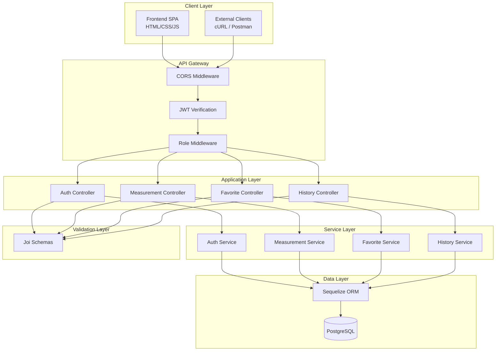
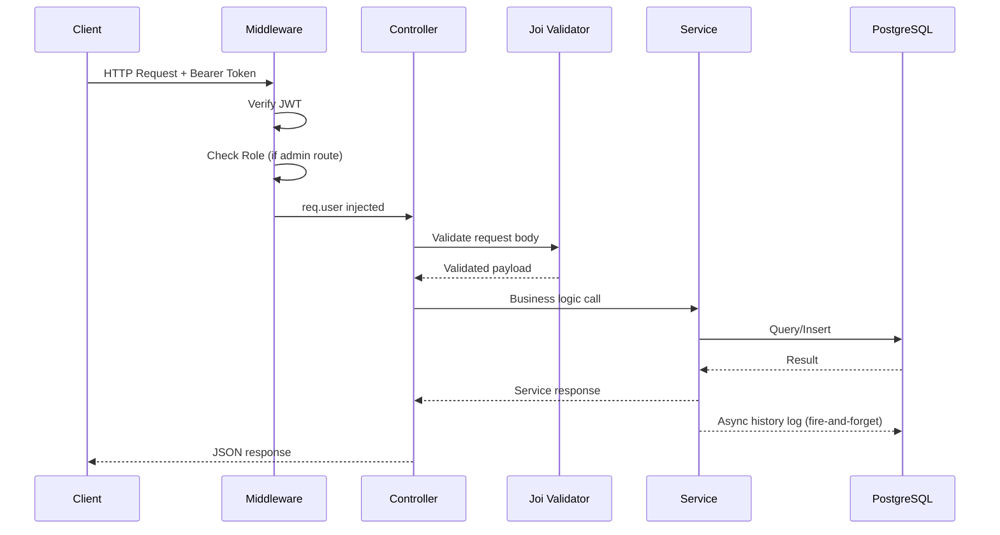
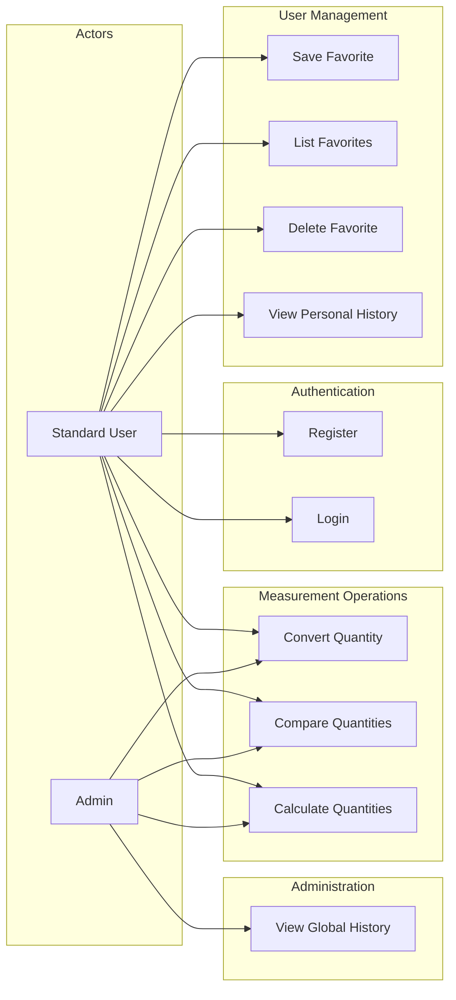
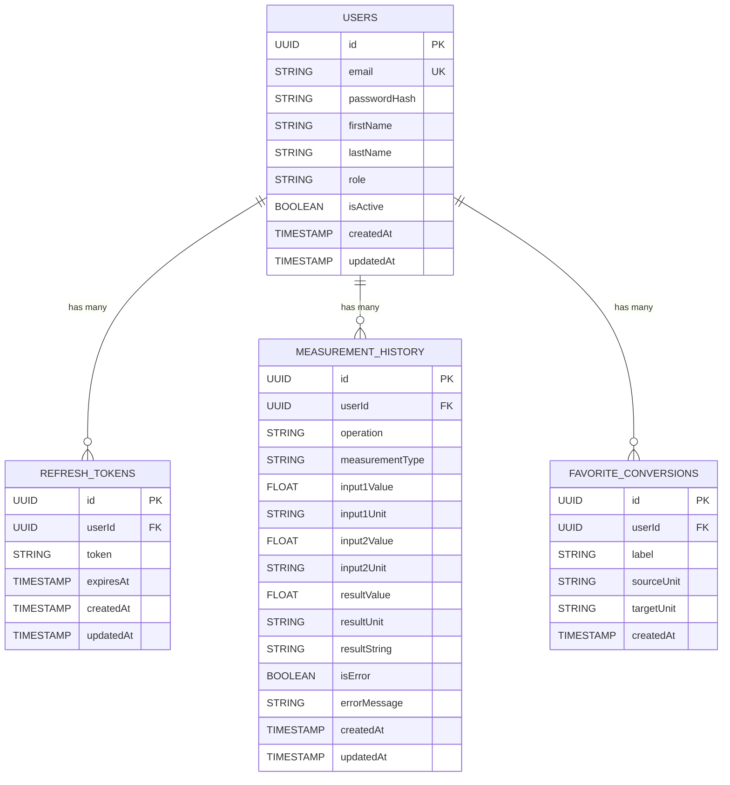
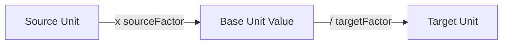
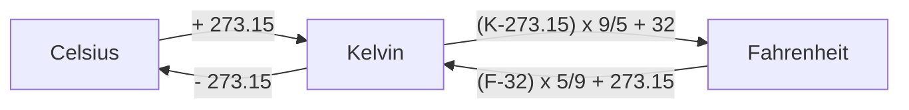
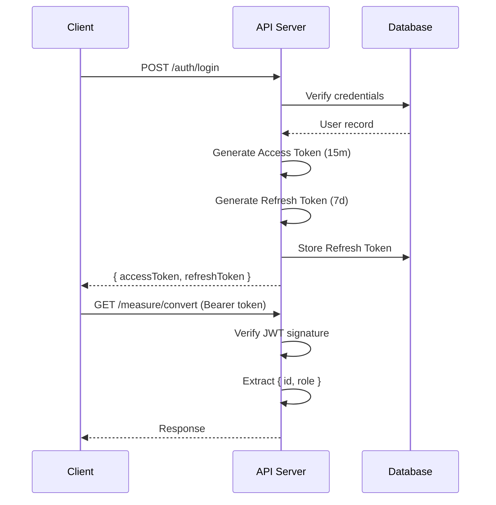

<div align="center">

# QuantiMeasure API

**A Secure, Multi-Tenant Quantity Measurement REST API**

Built with Express.js, PostgreSQL, and Sequelize ORM

[](https://nodejs.org)
[](https://expressjs.com)
[](https://postgresql.org)
[](LICENSE)

</div>

---

## Table of Contents

- [Overview](#overview)
- [Architecture](#architecture)
- [Tech Stack](#tech-stack)
- [Use Cases](#use-cases)
- [Data Model](#data-model)
- [API Reference](#api-reference)
- [Conversion Logic](#conversion-logic)
- [Authentication & Authorization](#authentication--authorization)
- [Project Structure](#project-structure)
- [Getting Started](#getting-started)
- [Deployment](#deployment)
- [Testing](#testing)

---

## Overview

QuantiMeasure is a production-grade REST API that provides unit conversion, comparison, and arithmetic calculation services across four measurement domains: **Length**, **Volume**, **Weight**, and **Temperature**. The system features JWT-based authentication, role-based access control (RBAC), persistent operation history, and a user-facing favorite conversion system.

### Key Capabilities

- Convert between units within the same measurement type
- Compare two quantities for mathematical equality
- Perform arithmetic (add, subtract, multiply, divide) across compatible units
- Save and manage favorite conversion routes
- View personal measurement history with pagination
- Admin-only global audit log with user attribution
- Responsive dark-theme frontend included

---

## Architecture

### System Architecture



### Request Lifecycle



---

## Tech Stack

| Layer | Technology | Purpose |
|---|---|---|
| Runtime | Node.js 20+ | JavaScript runtime |
| Framework | Express.js 5.x | HTTP server and routing |
| ORM | Sequelize 6.x | Database abstraction and migrations |
| Database | PostgreSQL 16+ | Relational data persistence |
| Auth | jsonwebtoken | JWT access and refresh token generation |
| Hashing | bcrypt | Password hashing with salt rounds |
| Validation | Joi | Request payload schema validation |
| CORS | cors | Cross-origin resource sharing |
| Frontend | Vanilla HTML/CSS/JS | Single-page application |
| Icons | Font Awesome 6 | UI iconography |
| Font | Inter (Google Fonts) | Typography |

### Design Patterns

- **Layered Architecture** — Controller, Service, Data Access separation
- **Fire-and-Forget Logging** — Async history persistence without blocking responses
- **Base Unit Normalization** — All conversions go through a base unit intermediary
- **Kelvin Bridge** — Temperature conversions use Kelvin as the universal base
- **Role-Based Access Control** — Middleware-level role enforcement
- **Epsilon Comparison** — Floating-point tolerance (1e-6) for equality checks

---

## Use Cases

### UC-01: User Registration

| Field | Value |
|---|---|
| Actor | Anonymous User |
| Description | Creates a new user account with hashed credentials |
| Endpoint | `POST /api/v1/auth/register` |
| Postcondition | User record created in USERS table |

### UC-02: User Login

| Field | Value |
|---|---|
| Actor | Registered User |
| Description | Authenticates credentials and issues JWT access + refresh tokens |
| Endpoint | `POST /api/v1/auth/login` |
| Postcondition | Access token (15m) and refresh token (7d) issued |

### UC-03: Convert Quantity

| Field | Value |
|---|---|
| Actor | Authenticated User |
| Description | Converts a value from one unit to another within the same measurement type |
| Endpoint | `POST /api/v1/measure/convert` |
| Postcondition | Conversion result returned, operation logged to history |

### UC-04: Compare Quantities

| Field | Value |
|---|---|
| Actor | Authenticated User |
| Description | Evaluates two quantities for mathematical equality using base unit normalization |
| Endpoint | `POST /api/v1/measure/compare` |
| Postcondition | "Equal" or "Not Equal" returned, comparison logged |

### UC-05: Calculate Quantities

| Field | Value |
|---|---|
| Actor | Authenticated User |
| Description | Performs ADD, SUBTRACT, MULTIPLY, or DIVIDE on two quantities with a target output unit |
| Endpoint | `POST /api/v1/measure/calculate` |
| Postcondition | Calculated result returned in target unit, operation logged |

### UC-06: Save Favorite Conversion

| Field | Value |
|---|---|
| Actor | Authenticated User |
| Description | Saves a labeled source-to-target unit mapping for quick access |
| Endpoint | `POST /api/v1/users/me/favorites` |
| Postcondition | Favorite record created, duplicate routes rejected |

### UC-07: View Personal History

| Field | Value |
|---|---|
| Actor | Authenticated User |
| Description | Retrieves paginated measurement history scoped to the authenticated user |
| Endpoint | `GET /api/v1/users/me/history` |
| Postcondition | Chronological audit log returned |

### UC-08: View Global Audit History (Admin)

| Field | Value |
|---|---|
| Actor | Admin User |
| Description | Retrieves system-wide measurement history with user attribution |
| Endpoint | `GET /api/v1/admin/history` |
| Postcondition | Global audit log with joined user info returned |

### Use Case Diagram



---

## Data Model

### Entity Relationship Diagram



### Operation Enum Values

| Operation | Source | Description |
|---|---|---|
| `CONVERT` | UC-03 | Unit conversion |
| `COMPARE` | UC-04 | Equality comparison |
| `ADD` | UC-05 | Arithmetic addition |
| `SUBTRACT` | UC-05 | Arithmetic subtraction |
| `MULTIPLY` | UC-05 | Arithmetic multiplication |
| `DIVIDE` | UC-05 | Arithmetic division |

---

## API Reference

### Authentication

#### Register

```
POST /api/v1/auth/register
```

```json
{
    "email": "user@example.com",
    "password": "securepass123",
    "firstName": "John",
    "lastName": "Doe"
}
```

**Response** `201 Created`

```json
{
    "success": true,
    "data": {
        "id": "uuid",
        "email": "user@example.com",
        "firstName": "John",
        "lastName": "Doe",
        "role": "USER"
    }
}
```

#### Login

```
POST /api/v1/auth/login
```

```json
{
    "email": "user@example.com",
    "password": "securepass123"
}
```

**Response** `200 OK`

```json
{
    "success": true,
    "data": {
        "user": { "id": "uuid", "email": "user@example.com", "firstName": "John", "role": "USER" },
        "accessToken": "eyJhbGciOi...",
        "refreshToken": "eyJhbGciOi..."
    }
}
```

---

### Measurement Operations

All measurement endpoints require `Authorization: Bearer <accessToken>`.

#### Convert

```
POST /api/v1/measure/convert
```

```json
{
    "value": 100,
    "sourceUnit": "CELSIUS",
    "targetUnit": "FAHRENHEIT"
}
```

**Response** `200 OK`

```json
{
    "success": true,
    "data": { "resultValue": 212, "resultUnit": "FAHRENHEIT" },
    "message": "Successfully converted 100 CELSIUS to FAHRENHEIT"
}
```

#### Compare

```
POST /api/v1/measure/compare
```

```json
{
    "qty1": { "value": 1, "unit": "YARD" },
    "qty2": { "value": 3, "unit": "FEET" }
}
```

**Response** `200 OK`

```json
{
    "success": true,
    "data": { "result": "Equal" },
    "message": "Compared 1 YARD with 3 FEET"
}
```

#### Calculate

```
POST /api/v1/measure/calculate
```

```json
{
    "op": "ADD",
    "qty1": { "value": 1, "unit": "GALLON" },
    "qty2": { "value": 3785.41, "unit": "ML" },
    "targetUnit": "LITRE"
}
```

**Response** `200 OK`

```json
{
    "success": true,
    "data": { "resultValue": 7.57082, "resultUnit": "LITRE" },
    "message": "ADD: 1 GALLON and 3785.41 ML = 7.57082 LITRE"
}
```

**Supported operations:** `ADD`, `SUBTRACT`, `MULTIPLY`, `DIVIDE`

---

### Favorites

#### Save Favorite

```
POST /api/v1/users/me/favorites
```

```json
{
    "label": "Baking Temp",
    "sourceUnit": "CELSIUS",
    "targetUnit": "FAHRENHEIT"
}
```

**Response** `201 Created`

#### List Favorites

```
GET /api/v1/users/me/favorites
```

#### Delete Favorite

```
DELETE /api/v1/users/me/favorites/:id
```

---

### History

#### Personal History

```
GET /api/v1/users/me/history?page=1&limit=20
```

**Response** `200 OK`

```json
{
    "success": true,
    "data": [ "...records" ],
    "pagination": {
        "page": 1,
        "limit": 20,
        "totalRecords": 47,
        "totalPages": 3
    }
}
```

#### Global Audit History (Admin Only)

```
GET /api/v1/admin/history?page=1&limit=20
```

Requires `role: ADMIN` in JWT. Returns records with joined user info (`email`, `firstName`, `lastName`).

---

### Supported Units

| Type | Units | Base Unit |
|---|---|---|
| **Length** | `INCH`, `FEET`, `YARD`, `CENTIMETER` | INCH |
| **Volume** | `ML`, `LITRE`, `GALLON` | ML |
| **Weight** | `GRAM`, `KG`, `TONNE` | GRAM |
| **Temperature** | `CELSIUS`, `FAHRENHEIT`, `KELVIN` | KELVIN (formula-based) |

### Error Response Format

All errors follow a consistent structure:

```json
{
    "success": false,
    "error": {
        "code": "ERROR_CODE",
        "message": "Human-readable description"
    },
    "timestamp": "2026-05-11T00:00:00.000Z"
}
```

| Code | HTTP | Description |
|---|---|---|
| `VALIDATION_ERROR` | 400 | Invalid request payload |
| `INVALID_UNIT` | 400 | Unknown unit identifier |
| `INVALID_UNIT_TYPE` | 400 | Cross-type operation (e.g. FEET to LITRE) |
| `UNSUPPORTED_OPERATION` | 400 | Arithmetic on temperature units |
| `DIVISION_BY_ZERO` | 400 | Division by zero |
| `DUPLICATE_FAVORITE` | 409 | Same source/target route already saved |
| `MISSING_TOKEN` | 401 | No authorization header |
| `INVALID_TOKEN` | 403 | Expired or malformed JWT |
| `FORBIDDEN` | 403 | Insufficient role privileges |
| `NOT_FOUND` | 404 | Resource does not exist |

---

## Conversion Logic

### Factor-Based Conversions (Length, Volume, Weight)

All non-temperature units use a base factor normalization strategy:

```
result = (inputValue * sourceBaseFactor) / targetBaseFactor
```



#### Base Factors

| Unit | Factor to Base | Base |
|---|---|---|
| INCH | 1 | INCH |
| FEET | 12 | INCH |
| YARD | 36 | INCH |
| CENTIMETER | 0.393701 | INCH |
| ML | 1 | ML |
| LITRE | 1000 | ML |
| GALLON | 3785.41 | ML |
| GRAM | 1 | GRAM |
| KG | 1000 | GRAM |
| TONNE | 1,000,000 | GRAM |

### Temperature Conversions (Kelvin Bridge)

Temperature conversions use formula-based Kelvin intermediary:



Arithmetic operations (ADD, SUBTRACT, MULTIPLY, DIVIDE) are explicitly **blocked** for temperature units because adding temperatures is physically meaningless.

### Comparison Strategy

Two quantities are considered equal when the absolute difference of their base unit values is less than `1e-6` (epsilon tolerance for floating-point arithmetic).

---

## Authentication & Authorization

### Token Flow



### Security Measures

| Measure | Implementation |
|---|---|
| Password Storage | bcrypt with 10 salt rounds |
| Token Algorithm | HS256 (HMAC-SHA256) |
| Access Token TTL | 15 minutes |
| Refresh Token TTL | 7 days |
| Role Enforcement | Middleware-level, extracted from JWT payload |
| Input Validation | Joi schemas on every endpoint |
| Data Isolation | All user queries scoped by `userId` from JWT |

### Role-Based Access Control

| Role | Capabilities |
|---|---|
| `USER` | Convert, Compare, Calculate, Favorites, Personal History |
| `ADMIN` | All USER capabilities + Global Audit History |

---

## Project Structure

```
QuantityMeasurementAPIV2/
├── public/                         # Frontend SPA
│   ├── index.html                  # Single-page application
│   ├── style.css                   # Dark theme design system
│   └── app.js                      # Client-side API logic
├── src/
│   ├── config/
│   │   └── database.js             # Sequelize PostgreSQL connection
│   ├── constants/
│   │   └── units.js                # Unit types, base factors, temperature formulas
│   ├── controllers/
│   │   ├── auth.controller.js      # Registration and login handlers
│   │   ├── measurement.controller.js  # Convert, compare, calculate handlers
│   │   ├── favorite.controller.js  # Favorite CRUD handlers
│   │   └── history.controller.js   # Personal and global history handlers
│   ├── middlewares/
│   │   ├── auth.middleware.js      # JWT verification (verifyToken)
│   │   └── role.middleware.js      # Role-based access control (requireRole)
│   ├── models/
│   │   ├── User.js                 # User model with role field
│   │   ├── RefreshToken.js         # Refresh token persistence
│   │   ├── MeasurementHistory.js   # Operation audit log
│   │   ├── FavoriteConversion.js   # Saved conversion routes
│   │   └── index.js                # Model associations
│   ├── routes/
│   │   ├── auth.routes.js          # /api/v1/auth/*
│   │   ├── measurement.routes.js   # /api/v1/measure/*
│   │   ├── user.routes.js          # /api/v1/users/me/*
│   │   ├── admin.routes.js         # /api/v1/admin/*
│   │   └── index.js                # Route aggregator
│   ├── services/
│   │   ├── auth.service.js         # Auth business logic
│   │   ├── measurement.service.js  # Conversion, comparison, calculation logic
│   │   ├── favorite.service.js     # Favorite CRUD with duplicate detection
│   │   └── history.service.js      # Paginated history queries
│   ├── validation/
│   │   └── schemas.js              # Joi validation schemas
│   ├── app.js                      # Express app configuration
│   └── server.js                   # Server bootstrap and DB sync
├── tests/
│   └── api.test.js                 # Integration test suite (140+ assertions)
├── .env                            # Environment variables (gitignored)
├── .example.env                    # Environment template
├── package.json
└── README.md
```

---

## Getting Started

### Prerequisites

- Node.js 20+
- PostgreSQL 16+
- npm 10+

### Installation

```bash
git clone https://github.com/Azaken1248/QuantityMeasurementAPIV2.git
cd QuantityMeasurementAPIV2
npm install
```

### Configuration

```bash
cp .example.env .env
```

Edit `.env`:

```env
PORT=8179
DB_HOST=localhost
DB_USER=postgres
DB_PASS=your_database_password
DB_NAME=quantity_measurement
JWT_ACCESS_SECRET=your_64_char_random_secret
JWT_REFRESH_SECRET=another_64_char_random_secret
```

Generate secrets:

```bash
node -e "console.log(require('crypto').randomBytes(64).toString('hex'))"
```

### Database Setup

```bash
sudo -u postgres psql
```

```sql
CREATE DATABASE quantity_measurement;
```

### Run

```bash
node src/server.js
```

Open `http://localhost:8179` for the frontend.

---

## Deployment

### Ubuntu + PM2

```bash
# Install dependencies
sudo apt update && sudo apt upgrade -y
curl -fsSL https://deb.nodesource.com/setup_20.x | sudo -E bash -
sudo apt install -y nodejs postgresql postgresql-contrib

# Setup database
sudo -u postgres psql -c "CREATE DATABASE quantity_measurement;"
sudo -u postgres psql -c "CREATE USER appuser WITH ENCRYPTED PASSWORD 'strong_password';"
sudo -u postgres psql -c "GRANT ALL PRIVILEGES ON DATABASE quantity_measurement TO appuser;"
sudo -u postgres psql -c "ALTER DATABASE quantity_measurement OWNER TO appuser;"

# Clone and configure
git clone https://github.com/Azaken1248/QuantityMeasurementAPIV2.git
cd QuantityMeasurementAPIV2
npm install
cp .example.env .env
nano .env  # Fill in production values

# Start with PM2
sudo npm install -g pm2
pm2 start src/server.js --name quantimeasure
pm2 startup
pm2 save
```

### Nginx Reverse Proxy (Optional)

```nginx
server {
    listen 80;
    server_name your_domain.com;

    location / {
        proxy_pass http://127.0.0.1:8179;
        proxy_http_version 1.1;
        proxy_set_header Upgrade $http_upgrade;
        proxy_set_header Connection 'upgrade';
        proxy_set_header Host $host;
        proxy_set_header X-Real-IP $remote_addr;
        proxy_set_header X-Forwarded-For $proxy_add_x_forwarded_for;
        proxy_cache_bypass $http_upgrade;
    }
}
```

---

## Testing

The project includes a comprehensive integration test suite with 140+ assertions covering all endpoints, validation rules, edge cases, and RBAC enforcement.

```bash
# Ensure the server is running first
node src/server.js

# In another terminal
node tests/api.test.js
```

### Test Coverage

| Suite | Tests | What's Covered |
|---|---|---|
| Auth Registration | 9 | Create, duplicate, validation |
| Auth Login | 5 | Success, wrong password, non-existent |
| Convert Auth Guard | 5 | No token, bad token, expired token |
| Convert Validation | 11 | Missing fields, invalid units, cross-type |
| Convert Length | 8 | FEET/INCH/YARD/CM conversions |
| Convert Volume | 3 | LITRE/ML/GALLON conversions |
| Convert Weight | 4 | KG/GRAM/TONNE conversions |
| Convert Temperature | 7 | C/F/K formulas, identity, crossover |
| Convert Edge Cases | 13 | Zero, negative, precision, large values |
| Compare Validation | 7 | Missing fields, cross-type rejection |
| Compare Equal | 9 | All measurement types |
| Compare Not Equal | 5 | Inequality and edge cases |
| Compare Structure | 5 | Response shape verification |
| Calculate Validation | 8 | Missing op, cross-type, temperature block |
| Calculate ADD | 5 | Cross-unit addition |
| Calculate SUBTRACT | 3 | Subtraction with different units |
| Calculate MULTIPLY | 2 | Multiplication and zero identity |
| Calculate DIVIDE | 4 | Division and division-by-zero |
| Calculate Structure | 5 | Response shape verification |
| Favorite Auth Guard | 2 | Token required for POST and GET |
| Favorite Validation | 5 | Missing fields, invalid units |
| Favorite CRUD | 8 | Create, duplicate, list, delete |
| History Auth Guard | 1 | Token required |
| History Pagination | 9 | Default, custom, beyond-page, ordering |
| Global History RBAC | 3 | No token, user rejected, admin access |
| Global History Data | 7 | User info, pagination |

---

<div align="center">

**Built by [Azaken1248](https://github.com/Azaken1248)**

</div>
